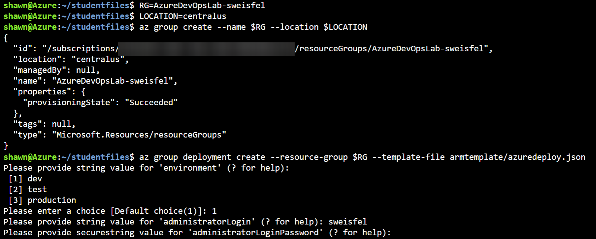

# Hands-on lab - Exercise 1

**Contents**
- [Setup](LabSetup)
- [**Exercise 1**](LabExercise01)
- [Exercise 2](LabExercise02)
- [Exercise 3](LabExercise03)
- [Exercise 4](LabExercise04)
- [Exercise 5](LabExercise05)
- [Exercise 6](LabExercise06)
- [Cleanup](LabCleanup)

[Last](LabSetup) | [Home](lab) | [Next](LabExercise02)

## Exercise 1: Create an Azure Resource Manager (ARM) template that can provision the web application, PostgreSQL database, and deployment slots in a single automated process

Duration: 45 Minutes

Tailspin Toys has requested three Azure environments (dev, test, production), each consisting of the following resources:

-   App Service

    -   Web App

    -   Deployment slots (for zero-downtime deployments)

-   PostgreSQL Server

    -   PostgreSQL Database

Since this solution is based on Azure Platform-as-a-Service (PaaS) technology, it should take advantage of that platform by utilizing automatic scale for the web app and the PostgreSQL Database PaaS service instead of running virtual machines.

### Task 1: Create an Azure Resource Manager (ARM) template using Azure Cloud Shell

1.  From within the **Azure Cloud Shell** locate the folder where you previously unzipped the Student Files. Open **Code** to this folder with the command below. It should also contain two sub-folders: **armtemplate** and **tailspintoysweb**.

    ```bash
    code .
    ```

    
  
2.  In the Code Explorer window, select the **armtemplate** sub-folder and open the **azuredeploy.json** file by selecting it.

    

3.  In the open editor window for the **azuredeploy.json**, scroll through the contents of the Azure Resource Manager Template. This template contains all the necessary code to deploy a Web App and a PostgreSQL database to Azure.

    >**Note**: If you would like to use this template in a future deployment of your own, it can be found in the [Azure Quickstart Templates repository on GitHub](https://github.com/Azure/azure-quickstart-templates). This specific file can be found [here](https://raw.githubusercontent.com/Azure/azure-quickstart-templates/master/101-webapp-managed-postgresql/azuredeploy.json).

### Task 2: Configure the list of release environments parameters

1.  Next, you need to configure a list of release environments we'll be deploying to. Our scenario calls for adding three environments: dev, test, and production. This is going to require the addition of some manual code. At the top of the **azuredeploy.json** file, locate the following line of code (on or around line 4).
    ```json
    "parameters": {
    ```  

2.  Insert the following code immediately below that line of code.
    ```json
    "environment": {
        "type": "string",
        "metadata": {
            "description": "Name of environment"
        },
        "allowedValues": [
          "dev",
          "test",
          "production"
        ]
    },
    ```

    After adding the code, it will look like this:

    

    Save the file.

    >**Note**: The **environment** parameter will be used to generate environment specific names for our web app.

### Task 3: Add a deployment slot for the "staging" version of the site

1.  Next, you need to add the "staging" deployment slot to the web app. This is used during a deployment to stage the new version of the web app. This is going to require the addition of some additional code. In the **azuredeploy.json** file, add the following code to the "resources" array, just above the element for the "connectionstrings" (on or around line 156).

    ```json
    {
        "apiVersion": "2016-08-01",
        "name": "staging",
        "type": "slots",
        "tags": {
            "displayName": "Deployment Slot: staging"
        },
        "location": "[resourceGroup().location]",
        "dependsOn": [
            "[resourceId('Microsoft.Web/Sites/', variables('webAppName'))]"
        ],
        "properties": {
        },
        "resources": []
    },
    ```

    After adding the code, it will look like this:

    Save the file.

    

### Task 4: Create the dev environment in Azure

Now that the template file has been uploaded, we'll deploy it several times to create each of our desired environments: "dev", "test", and "production". Let's start with the "dev" environment.

1.  In the **Azure Cloud Shell** terminal, execute the following commands:

    > NOTE: Name your resource group asollows AzureDevOpsLab-alias. For example mine would be named "AzureDevOpsLab-sweisfel".

    ```bash
    RG=<your resource group>
    LOCATION=<the azure region you want to deploy to (i.e. centralus)>
    az group create --name $RG --location $LOCATION
    az group deployment create --resource-group $RG --template-file armtemplate/azuredeploy.json
    ```

5.  Next, we're asked to enter a choice for environments we want to deploy to. The template will use our choice to concatenate the name of the environment with the name of the resource during provisioning. 
    
6.  For this first run, select the "dev" environment by entering **1** and then pressing **Enter**. 

7.  Next, we're asked to supply an administrator login (username) for the PostgreSQL server and database. This will be the username credential you would need to enter to connect to your newly created database.

8.  Enter a value for the "administratorLogin" (i.e. use your alias) and then press **Enter**.

9.  Next, we're asked to supply an administrator password for the PostgreSQL server and database. This will be the password credential you would need to enter to connect to your newly created database. Enter a value for the "administratorLoginPassword" and then press **Enter**.

    

    This will kick off the provisioning process which takes a few minutes to create all the resources for the environment. This is indicated by the "Running" text displayed at the bottom of the Azure Cloud Shell while the command is executing.

11. After the template has completed, JSON is output to the Azure Cloud Shell window with a "Succeeded" message.

    

    >**Note**: The above steps were used to provision the "dev" environment. Most of these same steps will be repeated for the "test" and "production" environments below.

### Task 5: Create the test environment in Azure

1.  In the Azure Cloud Shell terminal, enter the same command as last time and press **Enter**:

    ```bash
    az group deployment create --resource-group $RG --template-file armtemplate/azuredeploy.json
    ```
    
4.  For this next run, select the "test" environment by entering **2** and then pressing **Enter**. 

5.  Enter the same value for the "administratorLogin" that you did earlier and then press **Enter**.

6.  Enter the same value for the "administratorLoginPassword" that you did earlier and then press **Enter**.

7.  After the template has completed, JSON is output to the Azure Cloud Shell window with a "Succeeded" message.

### Task 6: Create the production environment in Azure

1.  In the Azure Cloud Shell terminal, enter the same command as last time and press **Enter**:

    ```bash
    az group deployment create --resource-group $RG --template-file armtemplate/azuredeploy.json
    ```
    
4.  For this next run, select the "production" environment by entering **3** and then pressing **Enter**. 

5.  Enter the same value for the "administratorLogin" that you did earlier and then press **Enter**.

6.  Enter the same value for the "administratorLoginPassword" that you did earlier and then press **Enter**.

7.  After the template has completed, JSON is output to the Azure Cloud Shell window with a "Succeeded" message.

8.  In the Azure Portal, navigate to the resource group where all of the resources have been deployed. It should look similar to the screenshot below.

    >**Note**: The specific names of the resources will be slightly different than what you see in the screenshot based on the unique identities assigned.

    

[Last](LabSetup) | [Home](lab) | [Next](LabExercise02)