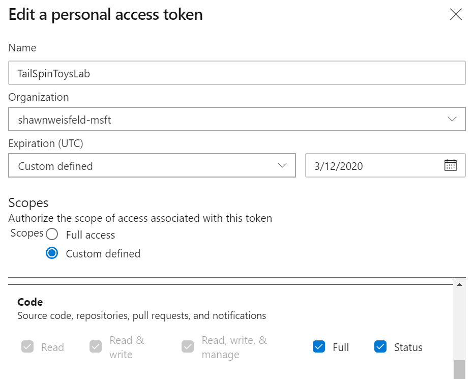

# Hands-on lab - Exercise 2

**Contents**
- [Setup](LabSetup)
- [Exercise 1](LabExercise01)
- [**Exercise 2**](LabExercise02)
- [Exercise 3](LabExercise03)
- [Exercise 4](LabExercise04)
- [Exercise 5](LabExercise05)
- [Exercise 6](LabExercise06)
- [Cleanup](LabCleanup)

[Last](LabExercise01) | [Home](lab) | [Next](LabExercise03)

## Exercise 2: Create Azure DevOps project and Git Repository

Duration: 15 Minutes

In this exercise, you will create and configure an Azure DevOps account along with an Agile project.

### Task 1: Create Azure DevOps Account

1.  Using a new browser tab, open the Azure DevOps site at [https://dev.azure.com](https://dev.azure.com).

2.  If you do not already have an account, select the **Start free** button.
    
    

3.  Be sure that you are authenticated with the SAME account that you used to log in to Azure with.

4.  Choose **Continue** to accept the Terms of Service, Privacy Statement, and Code of Conduct.

5.  Choose a name for new your project. For the purposes of this scenario, we will use "TailspinToys". Choose **Private** in the Visibility section so that our project is only visible to those who we specifically grant access. Then, select **+ Create project**.
    
    

6.  Once the Project is created, click on the **Repos** menu option in the left-hand navigation.

    

7.  On the **Repos** page for the **TailspinToys** repository, locate the "or push an existing repository from command line" section. Click the Copy button to copy the contents of the panel and save them in notepad. We're going to use these commands in an upcoming step.

    

8. Create a personal access tokens to authenticate access from the Git client in the Cloud Shell to the Git server running in Azure DevOps using the instructions [here](https://docs.microsoft.com/en-us/azure/devops/organizations/accounts/use-personal-access-tokens-to-authenticate?view=azure-devops&tabs=preview-page#create-personal-access-tokens-to-authenticate-access). NOTE: Give this token full & status permissions on your source code. Save the token in your notepad. 

    

### Task 2: Add the Tailspin Toys source code repository to Azure DevOps

In this Task, you will configure the Azure DevOps Git repository. You will configure the remote repository using Git and then push the source code up to Azure DevOps through the command line tools.

1.  Open the **Azure Cloud Shell** to the folder where the Student Files were unzipped (i.e. studentfiles). Then, navigate to the **tailspintoysweb** folder which contains the source code for our web application.

    > **Note**: If this folder doesn't exist ensure you followed the setup instructions.

2. Open Code to this folder by typing: 
   
   ```
   code .
   ``` 

   Then press **Enter**. 
   
   >**Note**: Be sure to include the period after the code command as this is what opens Code to the current folder.
   
3.  In a command prompt window, initialize a local Git repository by running the following command:

    > If a ".git" folder and local repository already exists in the folder, then you will need to delete the ".git" folder first before running the commands below to initialize the Git repository.

    ```
    git init
    ```

4.  Paste the first command you copied from Azure DevOps. It will resemble the command below:
    
    ```
    git remote add origin https://<your-org>@dev.azure.com/<your-org>/TailspinToys/_git/TailspinToys
    ```

5.  Enter the following commands to commit the changes made locally to the new repository:
    
    ```
    git add *
    git commit -m "adding files"
    ```

6.  Push the changes up to the Azure DevOps repository with the following command:

    ```
    git push -u origin --all
    ```

7.  Leave that command prompt window open and switch back to the web browser window for Azure DevOps from the previous Task. Navigate to the Repos > Files page which shows the files in the repository. You may need to refresh the page to see the updated files. Your source code is now appearing in Azure DevOps.

[Last](LabExercise01) | [Home](lab) | [Next](LabExercise03)